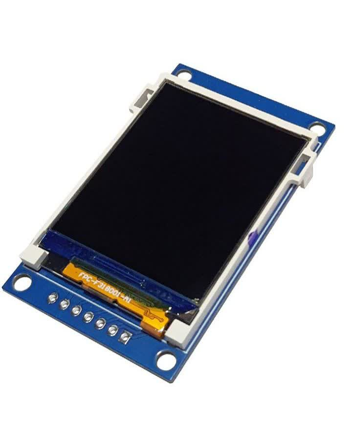
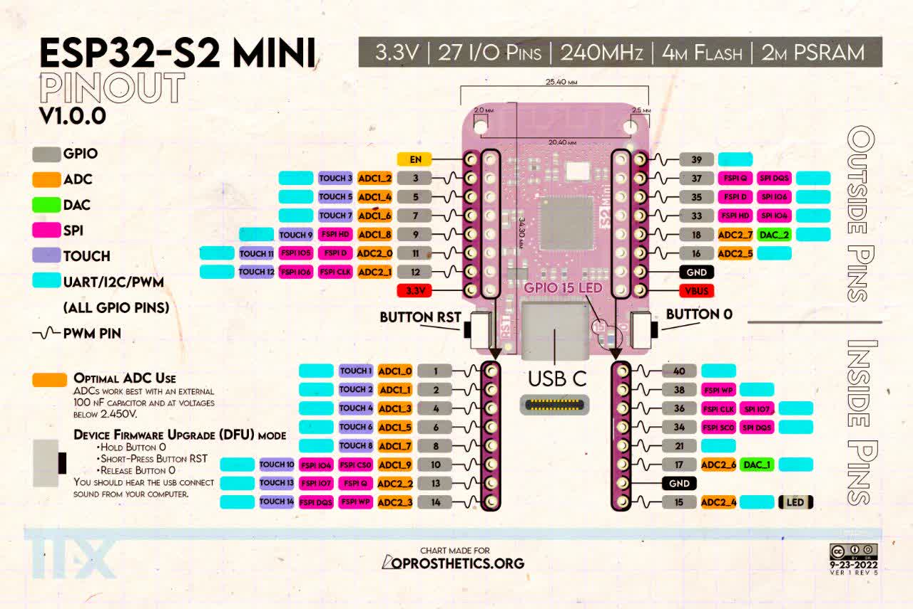
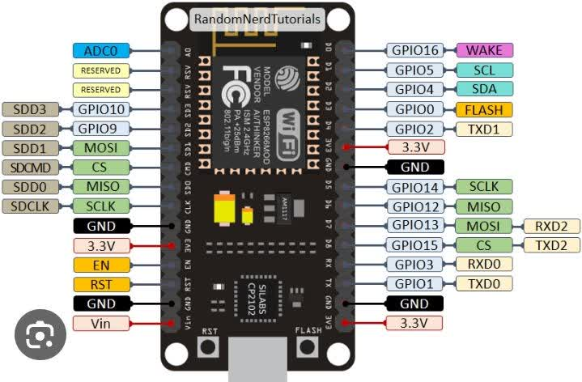

# 📟 SPFD54124B Library for Arduino / ESP8266 / ESP32 / ESP32-S2

[](https://www.arduino.cc/)
[](LICENSE)
[](https://github.com/Amirhm-e/SPFD54124B-library-for-Arduino-esp8266-esp32)
[]()

---

## 🧩 Overview
This library provides full control over the SPFD54124B TFT display driver, designed for use with Arduino, ESP8266, ESP32, and ESP32-S2 boards.  
It simplifies the process of drawing graphics, displaying text, and creating advanced UI elements.

---

## ⚙️ Features
- ✅ Full control of SPFD54124B-based displays  
- ✅ Compatible with Arduino, ESP8266, ESP32, ESP32-S2  
- ✅ Optimized for speed and low memory usage  
- ✅ Based on Adafruit_GFX core  
- ✅ Supports custom fonts and shapes  
- ✅ Smooth screen refresh  

---

## 🧰 Installation

1. Download or clone this repository:
   `bash
   git clone https://github.com/Amirhm-e/SPFD54124B-library-for-Arduino-esp8266-esp32.git

2. Copy the folder into your Arduino libraries directory.


3. Restart Arduino IDE.


4. Open File > Examples > SPFD54124B > Demo to test it.


---

🖥️ Supported Boards

Board	Status

Arduino UNO / Mega	✅ Tested
ESP8266	✅ Tested
ESP32	✅ Tested
ESP32-S2	✅ Tested & optimized


---

💡 Example Code


```cpp
#include <Adafruit_GFX.h>
#include <Amirhm_e_SPFD54124B.h>
#include <Fonts/FreeSerif9pt7b.h>
#include <Fonts/FreeSansBoldOblique24pt7b.h>

#define TFT_CS          22
#define TFT_RESET       23
#define TFT_CLK         21
#define TFT_DATA        19

#define BLACK           0x0000
#define BLUE            0x001F
#define RED             0xF800
#define GREEN           0x07E0
#define CYAN            0x07FF
#define MAGENTA         0xF81F
#define YELLOW          0xFFE0
#define WHITE           0xFFFF

Amirhm_e_SPFD54124B display(TFT_DATA,TFT_CLK,TFT_RESET, TFT_CS);

void setup(void)
{
    display.begin();
    Serial.begin(115200);
    display.setRotation(1);
    unsigned long time;
    time = millis();

    display.fillScreen(WHITE);
    display.fillScreen(BLACK);

    Serial.println(millis() - time);

    display.fillRect(100, 10, 20, 20, CYAN);

    display.setTextColor(WHITE);

    display.setCursor(5, 30);
    display.setFont();
    display.print("Hello World");

    display.setTextColor(BLUE);

    display.setCursor(5, 50);
    display.setFont(&FreeSerif9pt7b);
    display.print("Hello World");

    display.setTextColor(YELLOW);
    display.setCursor(5, 110);
    display.setFont(&FreeSansBoldOblique24pt7b);
    display.print("Hello");
}

void loop() {}
```


🖼️ Preview Images

SPFD54124B Display

---------------------------------------------------------

---------------------------------------------------------

ESP32-S2 Mini Pinout

---------------------------------------------------------

---------------------------------------------------------

ESP8266 Board

---------------------------------------------------------

---------------------------------------------------------


---

🤝 Contributing

Pull requests are welcome!
If you’d like to add new examples or optimize performance, feel free to fork and contribute.


---

📜 License

This project is released under the MIT License.
See the LICENSE file for details.


---

🇮🇷 کتابخانه SPFD54124B برای Arduino / ESP8266 / ESP32 / ESP32-S2

این کتابخانه برای کنترل کامل نمایشگرهای SPFD54124B طراحی شده
و با بردهای Arduino، ESP8266، ESP32 و ESP32-S2 کاملاً سازگاره.
این پروژه بر پایه‌ی کتابخانه‌ی Adafruit_GFX ساخته شده و برای سرعت و کارایی بهینه‌سازی شده است.


---

✳️ ویژگی‌ها

کنترل کامل پیکسل، فونت و گرافیک

سازگار با چندین میکروکنترلر

سرعت بالا و حافظه‌ی کم

پشتیبانی از فونت و اشکال سفارشی

رفرش نرم و بدون نویز تصویر


---

🔧 نصب

1. ریپازیتوری را دانلود یا کلون کنید:

git clone https://github.com/Amirhm-e/SPFD54124B-library-for-Arduino-esp8266-esp32.git


2. فولدر را در مسیر Documents/Arduino/libraries کپی کنید.


3. Arduino IDE را ریستارت کنید.


4. از مسیر File > Examples > SPFD54124B > Demo مثال تست را اجرا کنید.


---

📷 تصاویر

نمایشگر	

---------------------------------------------------------

---------------------------------------------------------

برد ESP32-S2	

---------------------------------------------------------

---------------------------------------------------------


برد ESP8266

---------------------------------------------------------

---------------------------------------------------------
		


---

🔗 لینک‌ها

🔹 [GitHub Repository](https://github.com/Amirhm-e/SPFD54124B-library-for-Arduino-esp8266-esp32.git)

🔹 [Adafruit GFX Library](https://github.com/adafruit/Adafruit-GFX-Library.git)


---

⭐ Created with ❤️ by Amirhm-e